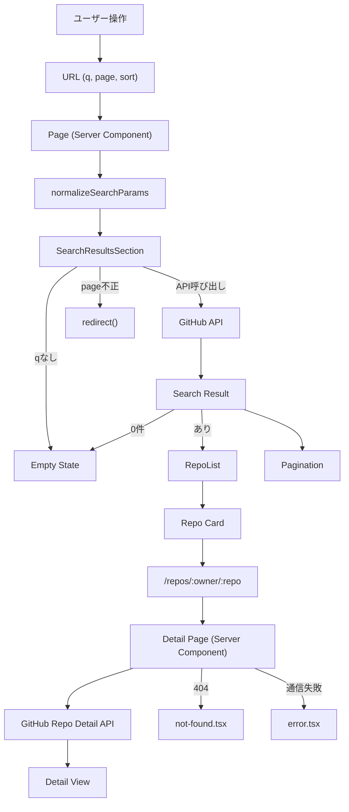

# GitHub Repo Search

GitHubのリポジトリを検索できるWebアプリケーションです。
Next.js App Routerをベースに作成しています。

---

## 🔗 デモ

後で記載する

---

## 🧑‍💻 概要

キーワードを入力するとGitHub APIを用いてリポジトリを検索し、一覧表示・並び替え・ページネーション・詳細表示ができます。

---

## 🚀 主な機能

- GitHubリポジトリ検索（URL連動）
- ソート（Best match / Stars / Forks / Updated）
- ページネーション（最大100ページ対応）
- リポジトリ詳細ページ
- 状態管理（Empty / Error / Not Found）

---

## 🧠 設計方針

### 1. URL = State

検索条件はすべてURLに反映しています。

```
?q=react&page=2&sort=stars
```

これにより以下を担保しています。

- 状態の再現性
- 共有可能なURL
- Server Componentとの相性

---

### 2. Server Component 主体の設計

- データ取得はServer Componentで実施
- Client Componentは最小限

こうすることで以下を実現しました。

- 不要な`useEffect`の排除
- パフォーマンス向上
- データ取得の責務分離

---

### 3. API層の分離

- `searchRepositories`
- `getRepositoryDetail`

などを分離し、UIとAPIの責務を切り離しています。

---

### 4. 型安全な実装

- `@octokit/types`を使用
- APIレスポンスを型として利用

ただし UI コンポーネントでは、API型をそのまま使わず、必要最小限の型に変換することで責務を明確化しています。

---

### 5. UIコンポーネント設計

表示責務を持つコンポーネントと、ロジックを持つコンポーネントそれぞれを分離しています。

例：

- `RepoList`（表示）
- `SearchResultsSection`（ロジック）

---

## 🎨 UI / UX

- Tailwind CSS v4
- shadcn/ui
- レスポンシブ対応（SP/PC）

---

## ♿ アクセシビリティ

- Chrome拡張機能「axe DevTools」を用いた手動検証で、主要画面において自動検査エラーなし（WCAG 2.1 AA 相当）
- semantic HTMLの適切な使用
- aria属性の付与
- focus-visible対応
- キーボード操作に対応

### axe 検証手順

1. ローカル開発環境でアプリケーションを起動する（例: `npm run dev` で `http://localhost:3000` を開く）
2. ブラウザに axe DevTools をインストールし、有効化する
3. 検索画面 / 結果一覧 / 詳細画面を開き、それぞれで axe DevTools の自動検査を実行する
4. 重大度「minor」以上の問題が検出されないことを確認する

---

## 🧪 テスト

- Vitest + Testing Library

### カバー範囲

- UIコンポーネント
- 状態コンポーネント
- ユーティリティ関数

### 方針

- 振る舞いベースのテスト
- 実装詳細に依存しない
- モックを用いた責務分離

---

## ⚠️ エラーハンドリング

### 404

- `notFound()`により`not-found.tsx`へ

### 通信エラー

- `error.tsx`でハンドリング

責務を明確に分離しています。

---

## 🔍 SEO / Metadata

- ページごとに`title`を設定
- 詳細ページは`noindex, follow`

---

## 🏗 アーキテクチャ



---

## 🧠 設計における意思決定ログ

### 1. URL = state を採用

検索条件はすべてURLで管理する設計を採用しています。  
これにより状態の再現性や共有性が担保され、Server Componentとも自然に連携できます。  
`useState`による管理も検討しましたが、URLと状態が乖離しやすく、リロード時に状態が失われるため採用していません。

---

### 2. Server Component 主体

データ取得はServer Componentで行い、Client Componentは最小限に抑えています。  
これにより`useEffect`への依存を減らし、パフォーマンスと責務の分離を両立しています。  
Client側でのfetchも検討しましたが、ローディング管理の複雑化や不要な再レンダリングを招くため不採用としました。

---

### 3. API層の分離

GitHub APIへのアクセスは`searchRepositories`や`getRepositoryDetail`といった関数に切り出しています。  
これによりUIからAPIの依存を分離し、テストしやすく保守性の高い構造にしています。

---

### 4. UIコンポーネントとロジックの分離

表示専用コンポーネントとロジックを持つコンポーネントを分離しています。  
例えば`RepoList`は表示のみ、`SearchResultsSection`はデータ取得や分岐を担当します。  
この分離により再利用性・可読性・テスト容易性を向上させています。

---

### 5. API型をそのまま使わない

Octokitの型は情報量が多く、そのままUIに渡すと責務が曖昧になります。  
そのためUI用に必要なプロパティだけを持つ型（例: RepoListItem）を定義しています。  
これによりコンポーネントの責務が明確になり、テストもしやすくなります。

---

### 6. エラーハンドリングの分離

404と通信エラーを明確に分けて扱っています。  
404は`notFound()`によってnot-foundページへ、通信エラーはerrorページでハンドリングします。  
これによりユーザー体験を適切に分けつつ、Next.jsの責務に沿った実装にしています。

---

### 7. アクセシビリティ優先設計

semantic HTMLやaria属性、focus-visibleの対応などを行い、キーボード操作も含めたアクセシビリティを担保しています。  
axeによる検証も実施し、実務レベルのUI品質を満たすことを重視しています。

---

### 8. テスト戦略

テストは振る舞いベースで記述し、コンポーネントの責務ごとに分離しています。  
例えば`RepoList`は表示確認、`SearchResultsSection`は分岐ロジックを検証します。  
これによりテストの意図が明確になり、保守しやすい構成にしています。

---

## 🛠 技術スタック

- Next.js (App Router)
- TypeScript
- Tailwind CSS
- shadcn/ui
- lucide-react
- Vitest / Testing Library

---

## ⚙️ セットアップ

### 前提条件

- **Node.js** `>=20.17`

```bash
git clone https://github.com/<your-username>/github-repo-search.git
cd github-repo-search
npm install
```

### 環境変数

リポジトリ直下の `.env.example` を `.env.local` にコピーし、値を設定してください。

```bash
cp .env.example .env.local
```

`.env.local` の内容:

```
GITHUB_TOKEN=your_token_here
```

`your_token_here` を実際の GitHub Personal Access Token に置き換えてください。

---

## ▶️ 実行

```bash
npm run dev
```

---

## 🧪 テスト実行

```bash
npm run test
```

---

## 💡 こだわったポイント

- Server Component中心設計
- UIとAPIの責務分離
- 型安全と実装のバランス
- テストとアクセシビリティの両立

---

## 🤖 AI活用について

本プロジェクトでは、開発効率と品質向上のためにAI（主にChatGPT / GitHub Copilot）を活用しています。

ただし、AIの出力をそのまま採用するのではなく、設計意図と責務を前提に取捨選択・改善を行うことを重視しています。

### 活用内容

#### 1. 実装補助

- コンポーネントの雛形作成
- テストコードの初期生成
- リファクタリング案の提案

これにより、実装スピードを向上させつつ、複数案から最適な設計を選択できるようにしました。

---

#### 2. 設計レビュー

- コンポーネント設計の妥当性確認
- 責務分離の見直し
- 型設計の改善

特に「API型をそのまま使わない」などの設計判断は、AIとの対話を通じて整理しています。

---

#### 3. テスト戦略の補助

- テスト観点の洗い出し
- モック設計の提案
- 不安定なテスト（flaky）の回避

単なるテスト生成ではなく、責務ごとにテストを分離する方針の整理に活用しています。

---

#### 4. デバッグ支援

- エラー原因の特定
- Next.js特有の挙動の整理（error / not-found の使い分けなど）

最終的な判断はドキュメントや挙動確認をもとに行っています。

---

### 意識したポイント

- AIの出力を鵜呑みにしない
- 常に「なぜこの実装か」を説明できる状態にする
- 設計の最終意思決定は自分で行う

---

### 効果

- 開発速度の向上（約50%程度の効率化）
- 設計の選択肢を広げられる
- レビュー観点の質が向上

以上となります。
ご確認よろしくお願いいたします。
